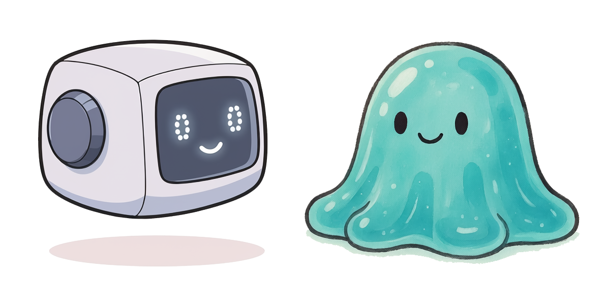

# Booklets

Small stories about AI, for kids and the adults near them. Each title in the *Mosey and Wobble* series stands alone.

{ alt="Mosey and Wobble Meet" }

### [Mosey and Wobble Meet](mosey-and-wobble-meet/index.md)

A small story about a robot, and the friend who tried to throw him off balance. Ten plans, ten fixes, and a quiet way to tell a steady AI from a wobbly one.

[Read →](mosey-and-wobble-meet/index.md){ .kids-button .kids-button--primary }
[Download PDF](mosey-and-wobble-meet/downloads/mosey-and-wobble-meet.pdf){ .kids-button .kids-button--secondary }

